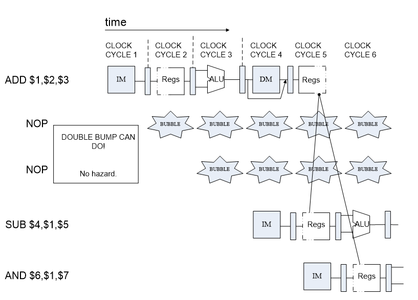
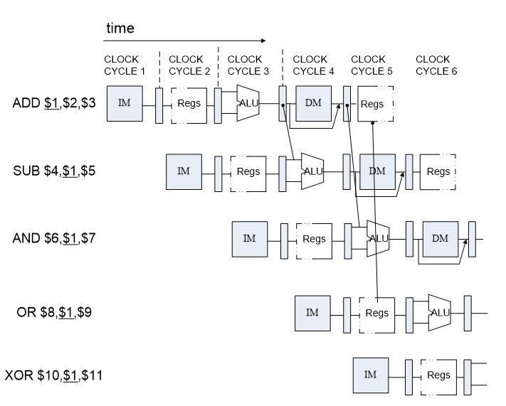
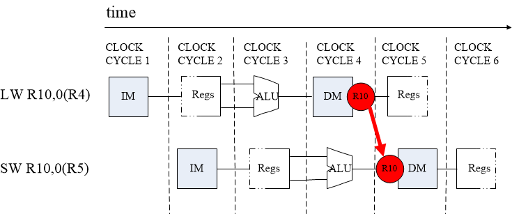
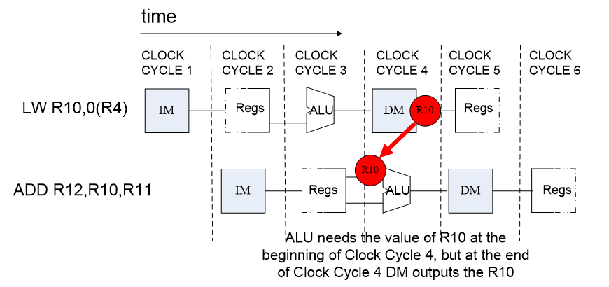

课程名称：**计算机体系结构** 实验类型：**综合** 实验项目名称：**LAB01** 
专业：**计算机科学与技术** 指导老师：**何水兵**

姓名 | 学号 | 分工
|:---:|:---:|:---:|
石嘉炜 | 3210105491 | 编程与测试
周小童（同组组员） | 3210105158 | 画图

## 一、实验目的、要求及任务
### （一）实验目的
- Understand  RISC-V RV32I instructions
- Master the design methods of pipelined CPU executing RV32I instructions
- Master the method of Pipeline Forwarding Detection and bypass unit design
- Master the methods of 1-cycle stall of Predict-not-taken branch design
- Master methods of program verification of Pipelined CPU executing RV32I instructions
### （二）实验任务
- Design the Bypass Unit of Datapath of 5-stages Pipelined CPU
- Modify the CPU Controller
- Conditions in Which Pipeline Forwards.
- Conditions in Which Pipeline Stalls.
- Verify the Pipeline CPU with program and observe the execution of program

## 二、实验内容与原理

### 大致模块拆解
1. 时钟
- clk_diff：提供一个稳定的时钟（**本实验中频率为200MHz**）
	- IBUFGDS：一个连接时钟信号BUFG或DCM的专用的差分信号输入缓冲器。在IBUFGDS中，一个电平接口用两个独立的电平接口（I和IB）表示。**只有在I和IB接口值不一致的时候才会为输出赋值，这个输出值与I端口一致**。在I和IB接口值不一致的时候，输出不变。
	- #(${codes})是为模块中的一些值赋值。

- my_clk_gen：从输出上来看应该是分频器（看着不像自己写的）
	- clk_disp：25MHz
	- clk_cpu：10MHz

2. 按钮
- btn_scan：从按钮阵列上读取输入，内置防抖动
	- 从输入上来看，应该是有五列四行按钮（还没看板子）
	- 输出中1所在的位决定了这个按钮在板上的位置
> 第5列第4行按钮为`interrupt`按钮
> 第5列第1行按钮为`step`按钮

3. 显示模块

4. RV32core：RISC-V流水线CPU架构

5. VGA调试

------

### RISC-V 32位 CPU架构（计算机组成中有过的内容这里不再详述）
1. 参数
- 输入：
	- debug_en：debug enable（SW[0]）
    - debug_step：debug step clock（btn_step：第5列第1行按钮）
    - [6:0] debug_addr：debug address
    - clk：main clock（clk_cpu：100MHz）
    - rst：synchronous reset
    - interrupter：interrupt source, **for future use**（SW[12]）
- 输出：
    - [31:0] debug_data,  // debug data
 
 2. IF阶段
 - REG_PC：PC寄存器
 - add_IF：得到PC+4
 - <font color=red>mux_IF：选取给到ID阶段的PC地址（PC+4或跳转地址）</font>
 - inst_rom：读取对应地址的指令

3. ID阶段
- reg_IF_ID
	```verilog
	 module    REG_IF_ID(input clk, 		   //IF/ID Latch
						input rst,  		   //流水寄存器使能
						input Data_stall,  		   //数据竞争等待
						input flush,       	 	   //控制竞争清除并等待
						input [31:0] PCOUT,  	   //指令存储器指针
						input [31:0] IR,     	   //指令存储器输出

						output reg[31:0] IR_ID,        //取指锁存
						output reg[31:0] PCurrent_ID   //当前存在指令地址
					);

	```
	
	- STALL时（**DATA HAZARD**）：输出保持原样
	- FLUSH时（**CTRL HAZARD**）：
		- IR_ID修改为：0x00000013，即ADDI zero zero 0（NOP）
		- PCurrent_ID修改为：PCOUT地址
- ctrl：解析指令（ID主要内容）并给出相关的控制指令：
	```verilog
	module CtrlUnit(
		input[31:0] inst,
		input cmp_res,
		output Branch, ALUSrc_A, ALUSrc_B, DatatoReg, RegWrite, mem_w,
			MIO, rs1use, rs2use,
		output [1:0] hazard_optype,
		output [2:0] ImmSel, cmp_ctrl,
		output [3:0] ALUControl,
		output JALR
		);
	```
	- Branch：是否跳转：<font color = red>包含了branch指令的判定与jal、jalr指令，这个操作其实不严谨</font>
	- ALUSrc_A/B：ALU输入选择信号
	- DatatoReg：是否为L型指令（是否将存储数据写入寄存器）
	- mem_w：是否为S型指令（mem_write）
	- MIO：是否为L/S型指令（Multiuse I/O？）
	- rs1/2use：是否在指令中使用到了rs1/2寄存器
	- hazard_optype：输入指令**潜在的**hazard类型
	- ImmSel：指令拆解成立即数的格式
	- cmp_ctrl：比较器控制信号（选择比较方式）
	- ALUControl：ALU计算方式
	- JALR：是否为JALR指令
- register：多了个Dubug_addr，和以前的没啥区别
- imm_gen：生成立即数
- mux_forward_A/B：选取实际操作中需要使用到的在ALU的A/B端口的数值
- jump指令地址获取：
	- mux_branch_ID：根据指令是否为JALR类型，选择当前PC（jal）/rs1（jalr）寄存器的地址
	- add_branch_ID：获取跳转地址
- hazard_unit：<font color=red>集合了hazard探测与forwarding的模块，这一部分会在下一标题进行详述。</font>

4. EX阶段
- reg_ID_EX：里面有个u_b_h_w（取fun3所在的三个bit），最后会在MEM阶段的data_ram模块里使用，<font color=red>ubhw，即unsigned、byte、half word、word</font>
- mux_A/B_EXE：选择进入ALU的A/B输入端口的数据
- alu
- mux_forward_EXE：根据forward_ctrl_ls（ls为load store的简称）决定是否使用mem阶段取出的数据

5. MEM阶段
- reg_MEM_WB
- data_ram：根据指令给出的存入的数据长度<font color=red>（b/h/w）</font>来存入数值

6. WB阶段
- reg_MEM_WB
- mux_WB

------

### 重点：Hazard_Unit

1. hazard与forward介绍

&emsp;&emsp;本次实验与计算机组成的流水线CPU最大的区别就是加入了hazard处理单元。首先先看一下期中一种hazard的情况：



&emsp;&emsp;以上述例子为例，如果不插入NOP的情况下，`sub $4,$1,$5`中一号寄存器的值则不会是上一步操作中的结果，因为上一步还没有进入WB阶段的时候，当前指令已经取出了一号寄存器的值，所以就会出现问题，我们当然可以很暴力地通过塞入NOP来等到值写回寄存器，但我们也可以在上一步进入EX阶段后把计算出的值提前拿出来，用到当前指令的EX阶段来运算，这就是forward的概念。下图是对forward概念的一个简单表现。



&emsp;&emsp;Store后接load也可能产生hazard，也需要进行forward：



&emsp;&emsp;但是forward不是万能的，我们不可能将还没计算完的结果给到下一步，例如下图，在这种情况下，插入nop不可避免。



2. 本实验中牵涉到的hazard与forward的情况介绍

- 潜在hazard指令分类：
	- 非LOAD/STORE外的所有指令
	- LOAD
	- STORE

- forward条件：
	- 对ALU：
		- EX阶段指令为非L/S指令：ID阶段指令rs1/rs2在使用且为EX阶段指令的rd（非x0寄存器），forward上条指令的ALU输出
		- MEM阶段指令为非L/S指令：ID阶段指令rs1/rs2在使用且为MEM阶段指令的rd（非x0寄存器），forward**EX/MEM寄存器中的**ALU输出
		- MEM阶段指令为LOAD：ID阶段指令rs1/rs2为MEM阶段指令的rd（非x0寄存器），forward MEM阶段的内存输出
		- **ID阶段指令为STORE，EX阶段指令为LOAD：ID阶段指令rs1/rs2在使用且为EX指令的rd（非x0寄存器），stall当前指令一个周期，等待EX阶段指令运行到下一阶段。**

	- 对L/S的数据：EX阶段指令为STORE，MEM阶段指令为LOAD，将STORE指令中准备给下一阶段内存写入的数据forward为LOAD出来的结果。

## 三、实验过程和数据记录

